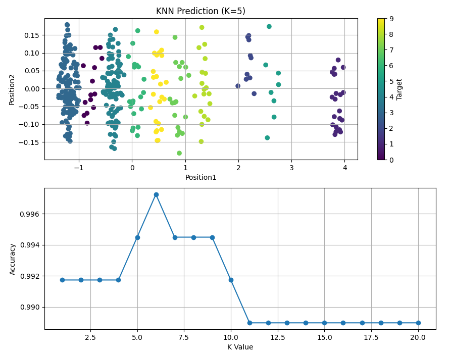

# Poker-ML
 For project machine learning

 

## Dataset
 file poker.xlxs sheetname : "dataset"

 H1 | H1 | H1 | H1 | H1 | Encode_sum | Position1 | Position2 | Rank |
----- | ----- | ----- | ----- | ----- | ----- | ----- | ----- | ----- |
K♠ | 6♦ | 6♣ | 3♠ | 2♠ | 7.1 | 7.436306977 | 7.892193044 | One pair |
3♦ | 9♣ | 4♥ | 2♣ | 7♥ | 5.23 | 6.022569589 | 5.630429378 | High card |
3♦ | 2♦ | 4♦ | K♦ | 4♥ | 7.21 | 8.108771429 | 7.462236452 | One pair |
J♣ | K♣ | 7♣ | 6♥ | 9♦ | 5.15 | 5.31652783 | 5.242784717 | High card |

	df = pd.read_excel('poker.xlsx',sheet_name = 'dataset')
	
	X = df[['Position1','Position2']]
	y = df['Rank']

**
 X -> Feature
 y -> Target

## Algorithm model

	from sklearn.svm import SVC
	from sklearn.naive_bayes import GaussianNB
	from sklearn.neural_network import MLPClassifier
	from sklearn.neighbors import KNeighborsClassifier
	from sklearn.model_selection import train_test_split
	from sklearn.ensemble import VotingClassifier
	
	X_train, X_test, y_train, y_test = train_test_split(X,y,test_size = 0.3)

•	SVM (Support vector machine)

	model = SVC(kernel = 'rbf',gamma = 1)

•	Neural Network

	model = MLPClassifier(hidden_layer_sizes = (4,5),activation = 'relu',solver = 'lbfgs',random_state = 0)

•	Gaussian Baye

	model = GaussianNB()

•	Voting Classifier (Assembly)

	all_model = [('svm',SVC(kernel = 'rbf',gamma = 1)),
			 ('knn',KNeighborsClassifier(n_neighbors = 5)),
			 ('ann',MLPClassifier(hidden_layer_sizes = (4,5),activation = 'relu',solver = 'lbfgs',random_state = 0)),
			 ('baye',GaussianNB())]

voting = VotingClassifier(all_model,voting = 'hard')

