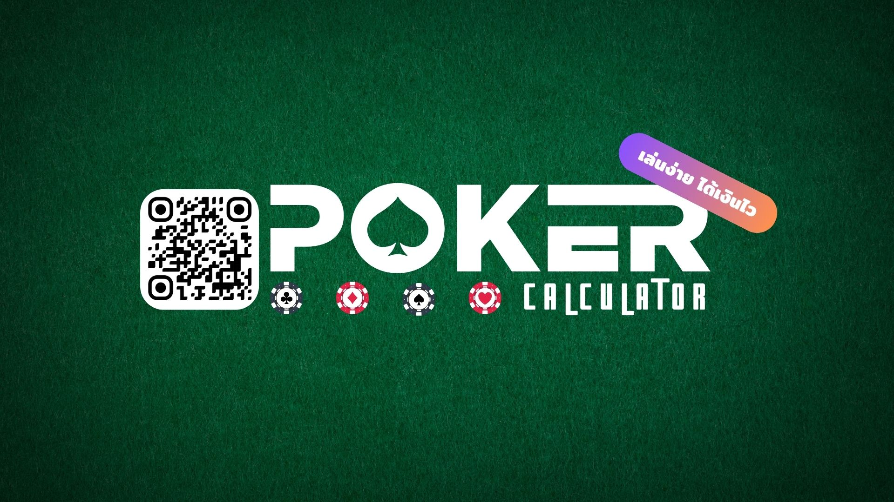

# Poker-ML
 For project machine learning

 

## Dataset
 file poker.xlxs sheetname : "dataset"

 H1 | H1 | H1 | H1 | H1 | Encode_sum | Position1 | Position2 | Rank |
----- | ----- | ----- | ----- | ----- | ----- | ----- | ----- | ----- |
K♠ | 6♦ | 6♣ | 3♠ | 2♠ | 7.1 | 7.436306977 | 7.892193044 | One pair |
3♦ | 9♣ | 4♥ | 2♣ | 7♥ | 5.23 | 6.022569589 | 5.630429378 | High card |
3♦ | 2♦ | 4♦ | K♦ | 4♥ | 7.21 | 8.108771429 | 7.462236452 | One pair |
J♣ | K♣ | 7♣ | 6♥ | 9♦ | 5.15 | 5.31652783 | 5.242784717 | High card |

	df = pd.read_excel('poker.xlsx',sheet_name = 'dataset')

	X = df[['Position1','Position2']]
	y = df['Rank']

**
 X -> Feature
 y -> Target